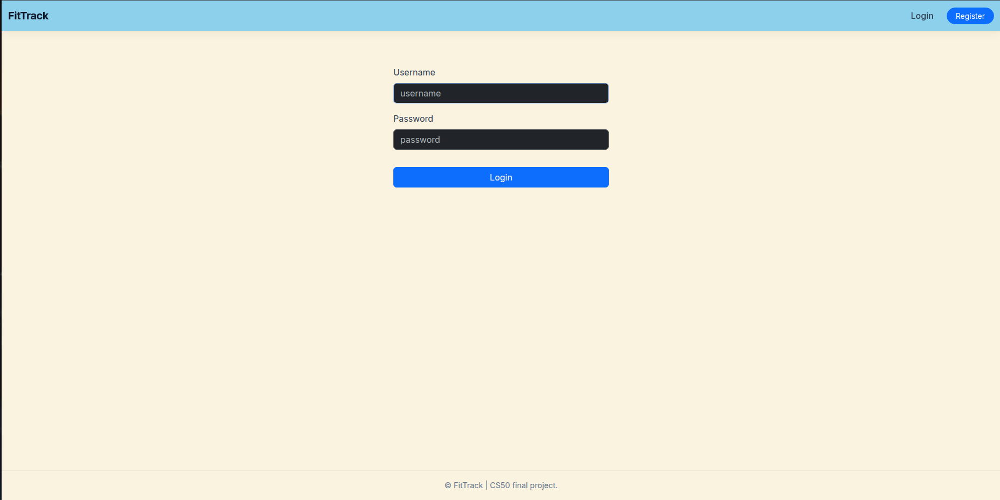
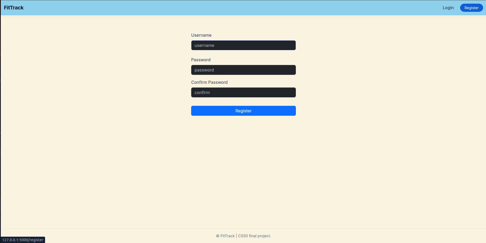
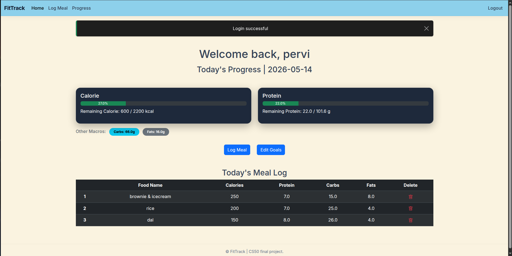
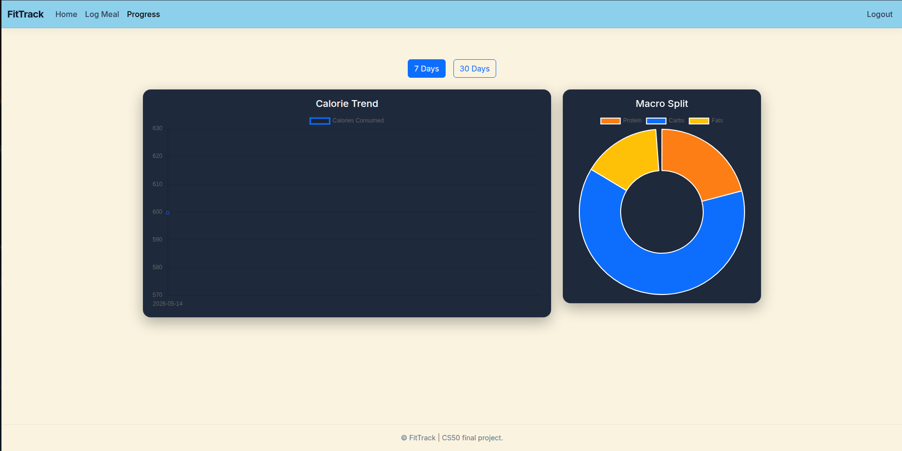
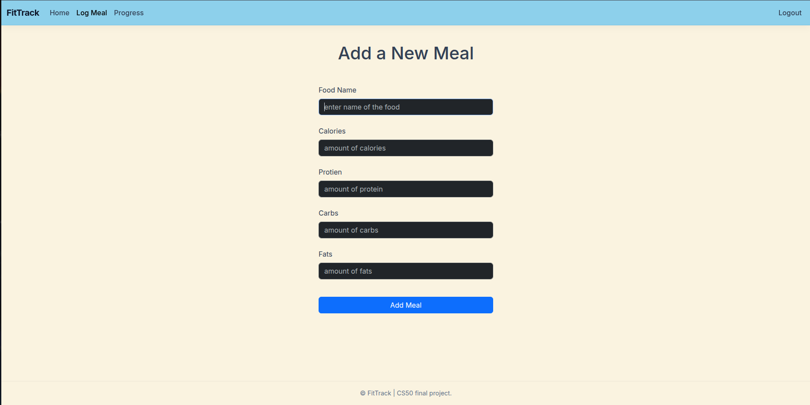
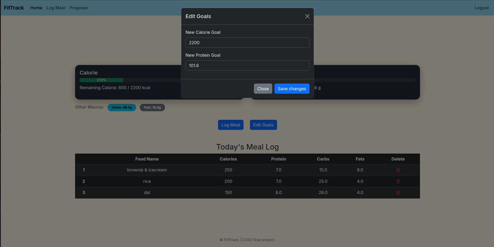

# ForgeFit
#### Video Demo:  https://youtu.be/Hj_cti1DWp8
#### If you wanna check it out: https://laym00n.pythonanywhere.com/ 
#### Description:

ForgeFit is a full-stack web application designed to empower users to take control of their physical fitness and nutrition by providing a centralized platform for tracking daily macronutrient intake and managing fitness goals. Developed as a final capstone project for CS50x, this tool simplifies the complexity of balancing diet with structured workout regimens.

The core philosophy behind ForgeFit is that consistent tracking of calories and protein is the absolute foundation of successful weight management, muscle hypertrophy, and overall health. Many existing fitness applications are overly cluttered with unnecessary features or locked behind premium paywalls. ForgeFit addresses this by providing a streamlined, intuitive, and highly responsive dashboard where users can easily set specific dietary targets, log meals constructed from raw ingredients, and visualize their daily progress in real-time. 

### Screenshots
* **Login & Register Page:** For user authentication I made a login page which uses a dismissable flash message for succesful login and same for registering new users using register page.
  
  
* **Dashboard & Progress Visualization:** A real-time overview of the user's daily nutritional budget, featuring dynamic progress bars and Chart.js integration.
  
  
* **Meal Logging Interface:** The robust input system where users can seamlessly record raw ingredients and view automatically calculated macronutrient totals.
  
* **Interactive Goal Editor:** The dynamic Bootstrap 5 modal dialog box that allows users to seamlessly update their fitness targets without leaving the main dashboard.
  

### Features
* **Personalized Goal Setting:** Users can define and dynamically update their daily calorie and protein targets to match their evolving fitness regimens. The system intelligently adapts, allowing users to shift from "bulking" to "cutting" phases seamlessly.
* **Meal Logging System:** A robust input system allows users to record daily meals (e.g., chicken breast, pasta, pulses) and automatically calculate total macros. This ensures high accuracy in dietary tracking without requiring the user to do manual math.
* **Dynamic Progress Visualization:** The user dashboard features real-time progress bars and interactive charts integrated via Chart.js. This provides an immediate visual overview of the nutritional budget for the day, clearly distinguishing between consumed calories and remaining allowances.
* **Secure Authentication:** User accounts and personal health data are protected via secure password hashing (using Werkzeug) and server-side session management, ensuring data remains completely private.

### Tech Stack
* **Backend:** Python (Flask), leveraging Flask-Session for secure user state management.
* **Database:** SQL (SQLite), accessed via the CS50 SQL library.
* **Frontend:** HTML5, CSS3 & JavaScript (Bootstrap 5, Chart.js), and Jinja2 templating.
* **Development Environment:** Linux (Ubuntu) using Visual Studio Code.

### Design Choices
During the development of ForgeFit, several key technical decisions were made to optimize performance, maintainability, and user experience:

1. **Database Architecture:** I opted for SQLite due to its lightweight, file-based nature. This makes it highly portable and perfectly suited for the CS50 environment and straightforward cloud deployment. The database is strictly normalized into discrete tables for `users` and `nutrition` logs, utilizing foreign keys to maintain referential integrity.
2. **Frontend Framework:** Bootstrap 5 was selected for the UI to ensure a modern, responsive layout. By leveraging its grid system, the application maintains a balanced interface across desktop and mobile devices. Additionally, I integrated Bootstrap's JavaScript bundle to power interactive UI elements—most notably, a dynamic modal dialog box that allows users to seamlessly edit their daily fitness goals without leaving the dashboard. This, along with mobile navigation toggles and dismissible flash alerts, enhances the overall user experience without the need to write heavy custom JS.
3. **Data Validation and Routing:** To prevent application crashes, robust server-side validation is implemented across all Flask routes. All user inputs for calorie and protein goals are strictly cast to integers or floats and verified before interacting with the SQLite database. Invalid inputs trigger user-friendly flash messages rather than internal server errors.

### Local Installation
To run this project locally:
1. Clone the repository and create a Python virtual environment.
2. Install dependencies via `pip install -r requirements.txt`.
3. Initialize the database using the provided schema.
4. Execute `python app.py` to launch the local development server.

### AI Disclosure & Academic Honesty
During the development of this project, conversational AI (Gemini) was utilized as an adaptive collaborator. AI assistance was primarily used for:
* **Data Visualization:** Understanding the documentation and implementation steps for integrating Chart.js within the `/progress` route to dynamically render user data.
* **Database Queries:** Guidance on resolving blockers when stuck on complex SQLite queries, including syntax for resetting auto-increment sequences.
* **Debugging:** Identifying and resolving backend logic errors, such as `ValueError` exceptions during integer and float type-casting in Flask routes.
* **UI/UX Refinement:** Recommendations on implementing Bootstrap 5 utility classes and components (like interactive modals) to improve the visual hierarchy and responsiveness of the dashboard.

All final code implementation, database schema design, and architectural decisions were independently made, rigorously tested, and reviewed by me to ensure original work and strict adherence to academic integrity guidelines.